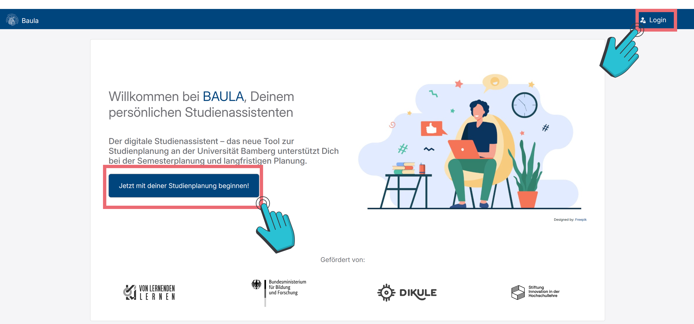
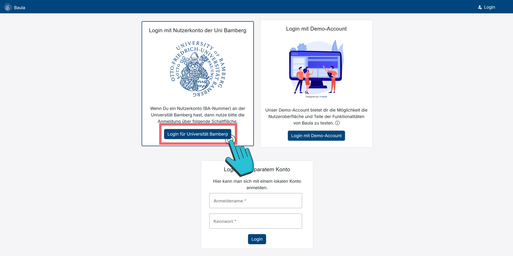
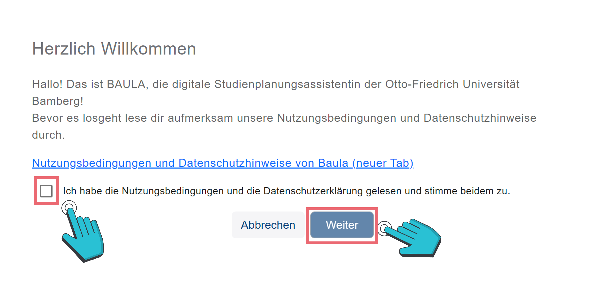
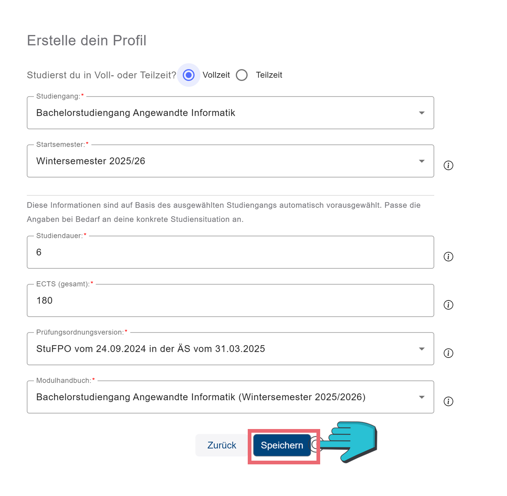
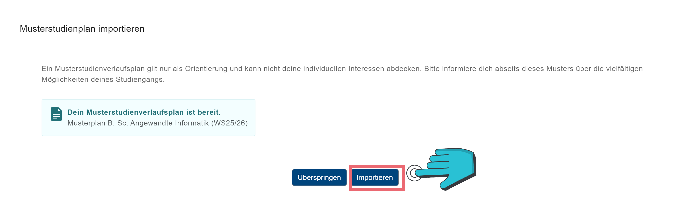

# Einen Account anlegen

Wenn du dir einen Account erstellen willst und dich auf der Seite [baula.minf.uni-bamberg.de](https://baula.minf.uni-bamberg.de) befindest, kannst du nun entweder auf „Jetzt mit deiner Studienplanung beginnen!“ (vgl. Abbildung 1) oder „Login“ (vgl. Abbildung 1) klicken. 

Anschließend wirst du automatisch auf die „Login“-Seite ([baula.minf.uni-bamberg.de/login](https://baula.minf.uni-bamberg.de/login)) weitergeleitet. Hier kannst du nun auf „Login für Universität Bamberg“ (vgl. Abbildung 2) drücken. Dann kannst du dich mit deiner ba-Nummer und deinem Passwort, wie z.B. bei dem VC, anmelden.

Wenn dies deine erste Anmeldung ist, musst du zunächst den Nutzungsbedingungen und der Datenschutzerklärung zustimmen (vgl. Abbildung 3), diese findest du unter [baula.minf.uni-bamberg.de/datenschutz](https://baula.minf.uni-bamberg.de/datenschutz).

Danach kannst du dein Profil anlegen und über die Formularfelder auswählen, was du studierst, usw (vgl. Abbildung 4). Manche Informationen werden automatisch ergänzt, wie z. B. nach welchem Modulhandbuch du studierst. Wenn alle Angaben vollständig sind, klicke auf Speichern.

Wenn ein Musterstudienverlauf für deinen Studiengang vorhanden ist, hast du anschließend die Möglichkeit, diesen in einem weiteren, sich automatisch öffnenden Dialog zu importieren (vgl. Abbildung 5).
