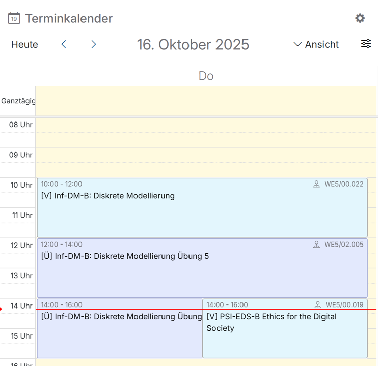

# Terminkalender

Dieses Widget gibt dir Informationen über aktuelle Termine, wie z.B. anstehende Lehrveranstaltungen. 

Die Ansicht kann durch einen Klick auf „Ansicht“ verändert werden, so dass eine Übersicht für den Tag, die Woche, oder den Monat angezeigt wird. Die Einstellung „Terminübersicht“ stellt die Termine in Textform untereinander dar.
