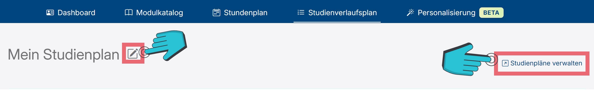
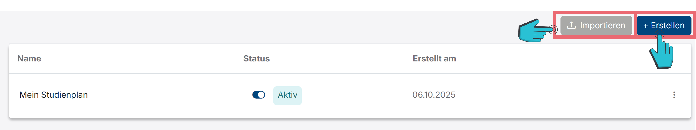
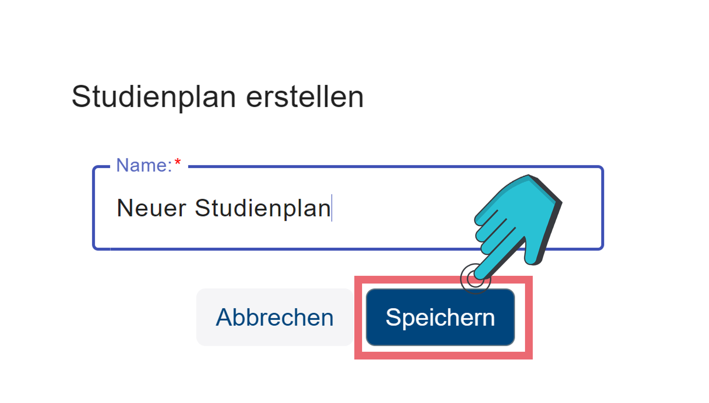
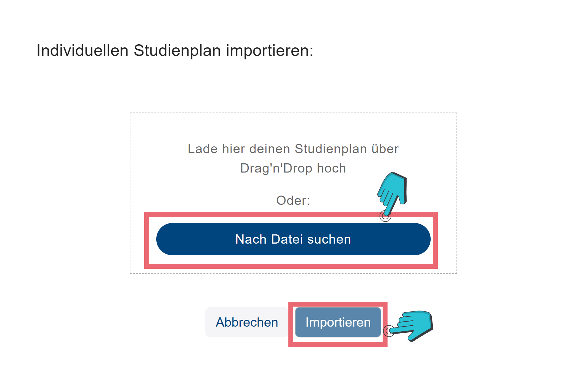
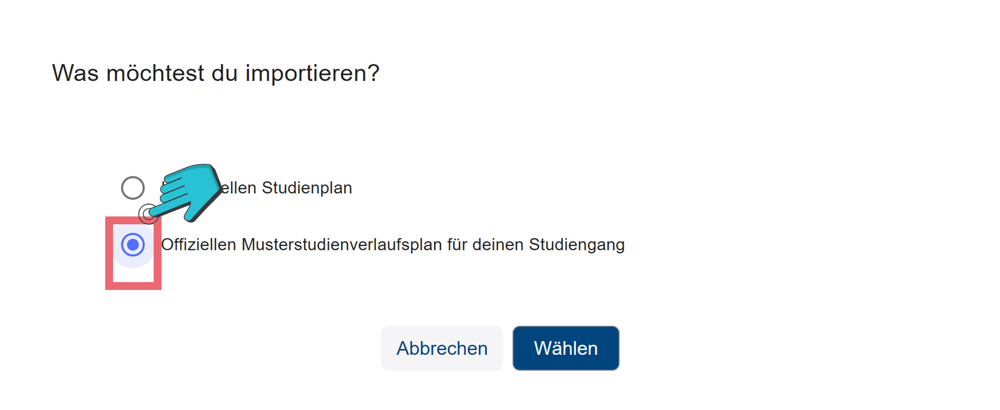

# Studienplan

<!-- Studienplan -->

Dein Studienplan enthält deine Semester und die Module, welche jeweils eingeplant sind. 
Wenn du auf das „Bearbeitungs“-Icon neben den Studienplannamen (vgl. Abbildung 19.1) drückst, öffnet sich ein neues Fenster, in welchem du den Namen des Studienplans anpassen kannst. Um den neuen Namen zu speichern, musst du anschließend auf den „Speichern“-Knopf (vgl. Abbildung 19.2) drücken.

Rechts findest du den „Studienpläne verwalten“-Knopf (vgl. Abbildung 19.1), welcher dich auf die Übersichtsseite für deine Studienpläne bringt.

<!-- Studienplan erstellen -->

Hier kannst du neue Studienpläne erstellen, indem du auf den „Erstellen“-Knopf (vgl. Abbildung 19.3) drückst, einen Namen eingibst und anschließend auf „Speichern“ (vgl. Abbildung 19.4 drückst).

<!-- Individuellen Studienplan importieren -->

Auch kannst du hier Studienpläne mithilfe des „Importieren“-Knopfs (vgl. Abbildung 19.3) laden.
Du hast hier die Möglichkeit einen Individuellen Studienplan (vgl. Abbildung 19.5) zu importieren. Dafür öffnet sich ein neues Fenster, in welchen du entweder den Individuellen Studienplan (dies ist ein Studienplan, welcher vorher eigens erstellt wurde) per Drag’n’Drop, oder indem du auf „Nach Datei suchen“ (vgl. Abbildung 19.6) drückst, hochladen und anschließend mit dem „Importieren“-Knopf (vgl. Abbildung 19.6) importieren.

<!-- Offiziellen Musterstudienplan importieren -->

Auch kannst du einen offiziellen Musterstudienverlaufsplan (ein Plan, welcher typische Module in den typischen Semestern enthält) importieren, indem du zuerst auf „Offiziellen Musterstudienverlaufsplan für deinen Studiengang“ (vgl. Abbildung 19.7) drückst. Anschließend öffnet sich ein neues Fenster, in dem du sehen kannst, ob für deinen Studiengang ein Musterstudienverlaufsplan existiert und dann das Startsemester auswählen kannst. Zum Schluss musst du dann auf „Importieren“ (vgl. 19.8) drücken.
