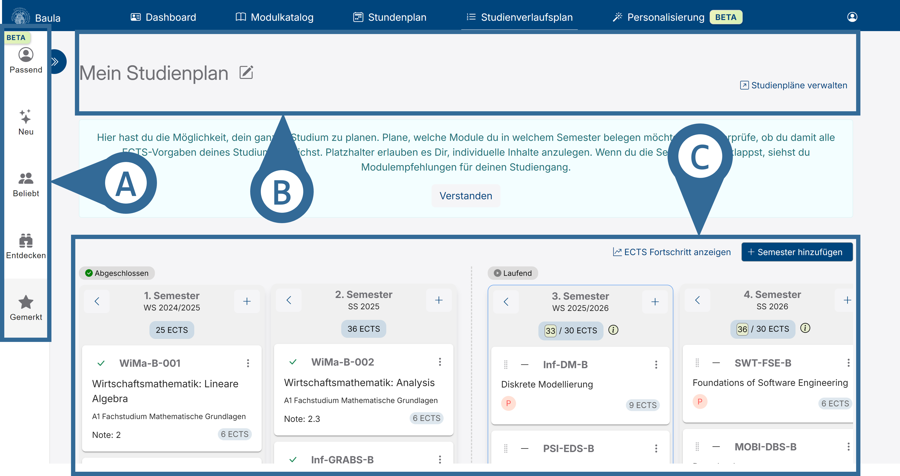

# Studienverlaufsplan

Der Studienverlaufsplan ermöglicht es dir, eine Übersicht über deine vergangenen, das aktuelle und die zukünftigen Semester zu sehen.

Links sind die Modulempfehlungen (vgl. Abbildung 19 A).
[!ref](./modulEmpfehlungen.md)

Oben befindet sich dein Studienplan (vgl. Abbildung 19 B).
[!ref](./studienplan.md)

Unten ist die Semesterübersicht (vgl. Abbildung 19 C).
[!ref](./semesterÜbersicht.md)