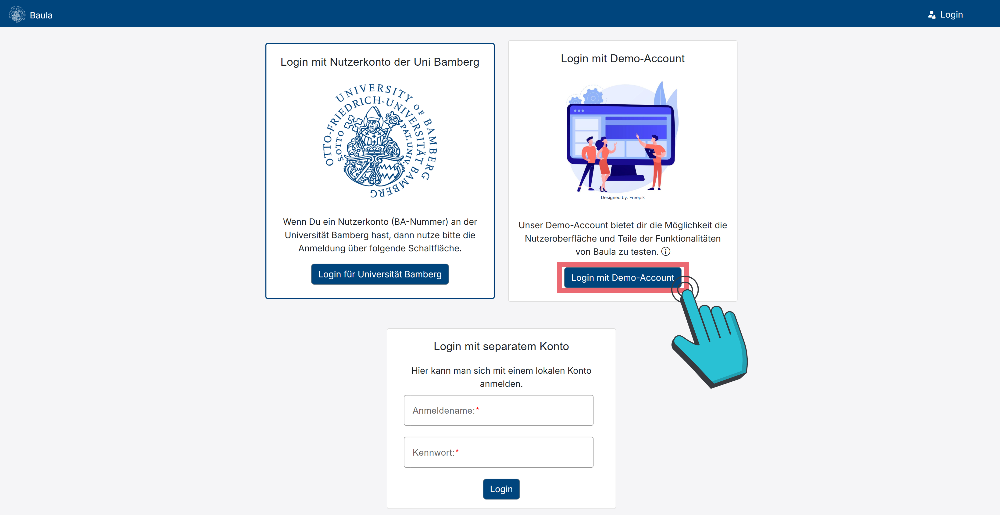

# Den Demo-Account benutzen
Wenn du erstmal Baula erkunden willst, ohne dir einen Account zu erstellen, kannst du den Demo-Account verwenden. Dieser ermöglicht es dir durch die verschiedenen Funktionalitäten, welche Baula zur Verfügung stellt, auszuprobieren, ohne etwas an deinem privaten Profil zu verändern. Bei diesem Demo-Account gilt es allerdings zu beachten, dass die Daten des Accounts nicht verändert werden können, wie z.B. das Modulhandbuch.

Wenn du dich auf der Seite [baula.minf.uni-bamberg.de](https://baula.minf.uni-bamberg.de) befindest musst du anschließend auf die <button class="btn btn-primary ms-2 d-sm-inline"> <i class="bi bi-person-fill-lock me-2"></i>Login</button>-Seite ([baula.minf.uni-bamberg.de/login](https://baula.minf.uni-bamberg.de/login)) navigieren (vgl. Abbildung 1).

Anschließend klickst du auf <button _ngcontent-ng-c1874965177="" class="btn btn-primary my-1 py-3 px-4"> Login mit Demo-Account </button> (vgl. Abbildung 2). Nun bist du mit dem Demo-Account angemeldet und in der Lage zwanglos die Website zu durchforsten.
