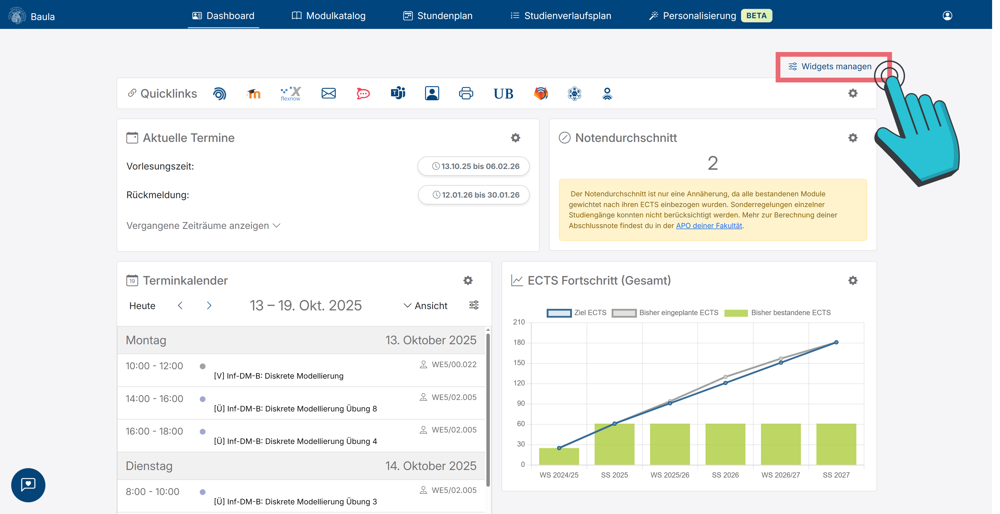

# Dashboard

Nach der Anmeldung siehst du immer erst einmal das Dashboard. Auf dem Dashboard hast du die Übersicht über deine Termine, deinen Notenschnitt, etc. Über <button class="mat-mdc-menu-trigger btn btn-outline btn-sm mb-0"><i class="icon bi bi-sliders fw-bold me-2"></i>Widgets managen</button> (vgl. Abbildung 1) kannst du wählen, welche Widgets du angezeigt haben möchtest und welche nicht.
