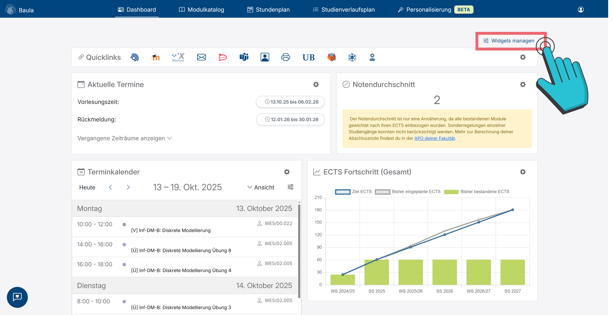

# Dashboard

Nach der Anmeldung siehst du immer erst einmal das Dashboard. Auf dem Dashboard hast du die Übersicht über deine Termine, deinen Notenschnitt, etc. Über „:icon-multi-select:Widgets managen“ (vgl. Abbildung 1) kannst du wählen, welche Widgets du angezeigt haben möchtest und welche nicht.
