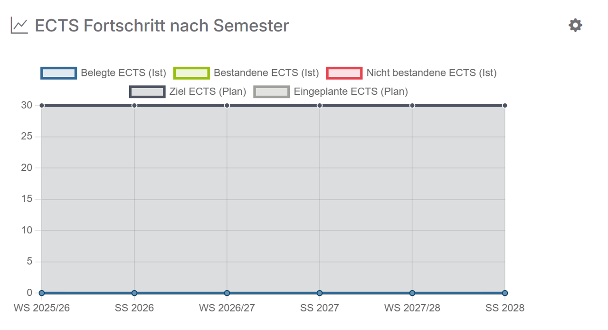

# ECTS Fortschritt nach Semester

Hier erhältst du eine Übersicht deiner ECTS nach Semester. Diese werden kategorisiert nach:

- Belegte ECTS (Ist): Dies sind die ECTS des Moduls, welche du besuchst.
- Bestandene ECTS (Ist): Dies sind die ECTS, welche du durch das Bestehen eines Moduls erhalten hast.
- Nicht bestandene ECTS (Ist): Dies sind die ECTS der Module, welche du bisher nicht bestanden hast.
- Ziel ECTS (Plan): Dies sind die vorgegebenen Ziel ECTS.
- Eingeplante ECTS (Plan): Dies sind die ECTS, welche du in dem jeweiligen Semester eingeplant hast.
