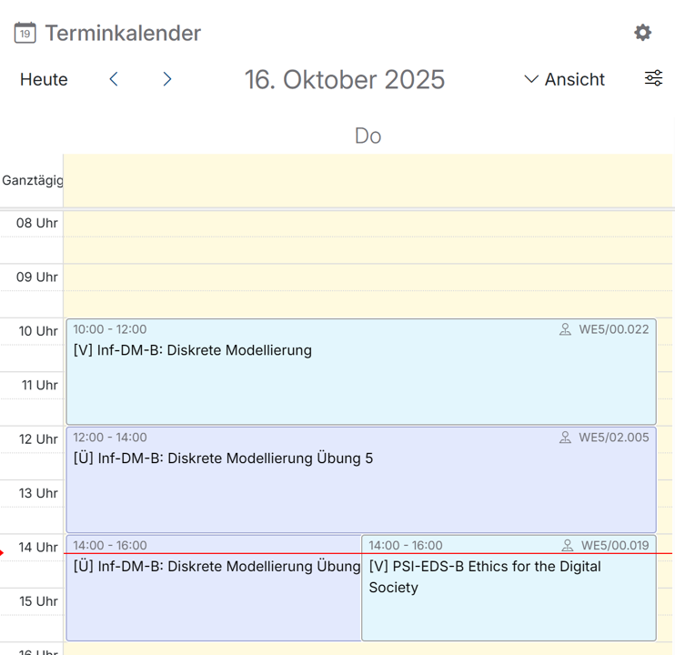

# Terminkalender

Dieses Widget gibt dir Informationen über aktuelle Termine, wie z.B. anstehende Lehrveranstaltungen. 

Die Ansicht kann durch einen Klick auf <button class="mat-mdc-menu-trigger btn" ><i class="bi bi-chevron-down"></i>Ansicht</button> verändert werden, so dass eine Übersicht für den Tag, die Woche, oder den Monat angezeigt wird. Die Einstellung „Terminübersicht“ stellt die Termine in Textform untereinander dar.
