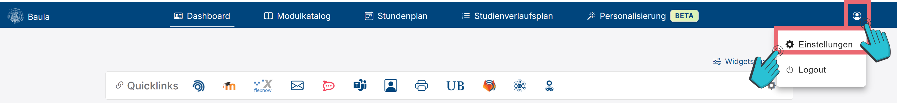
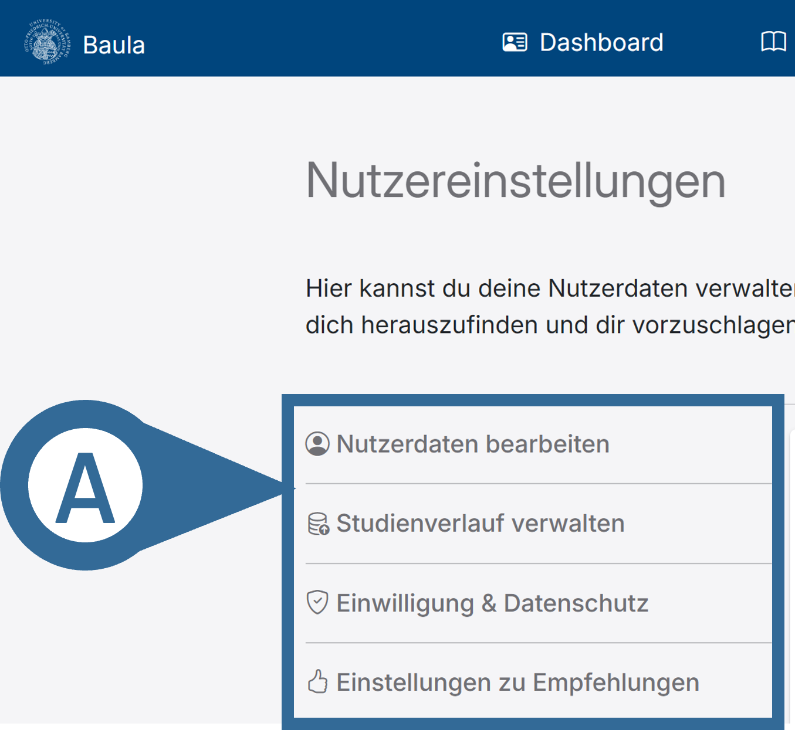
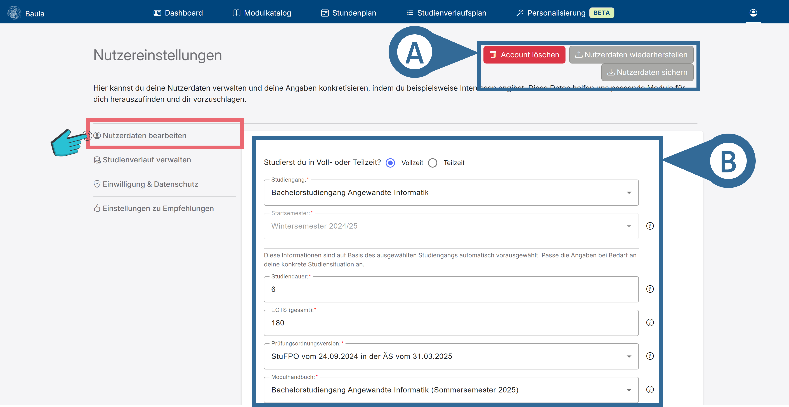
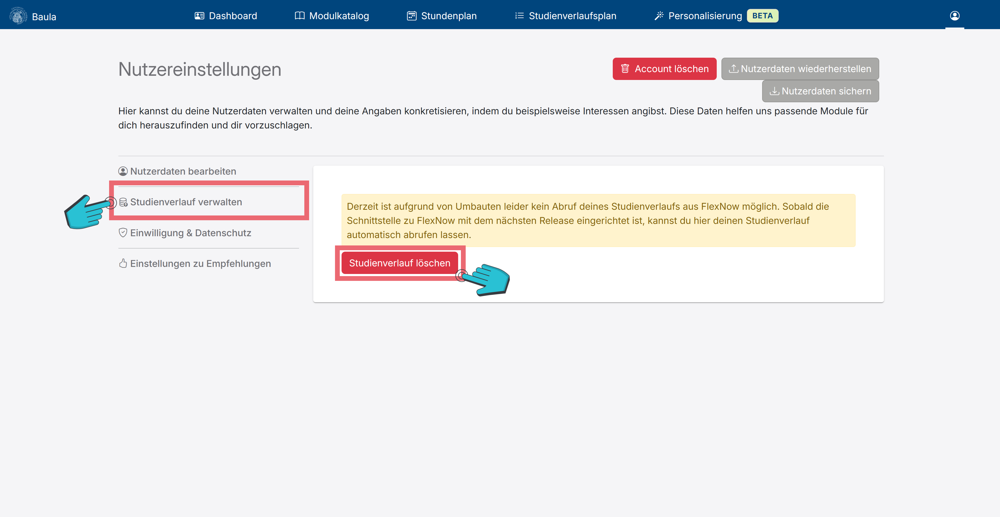
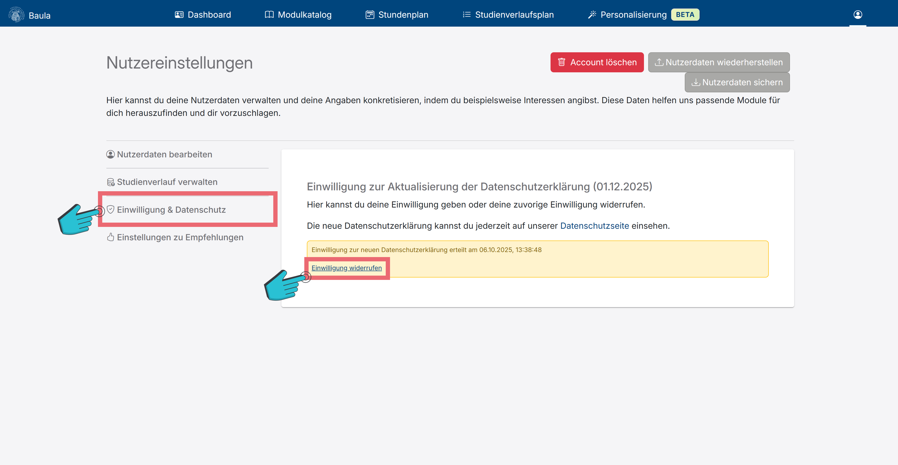
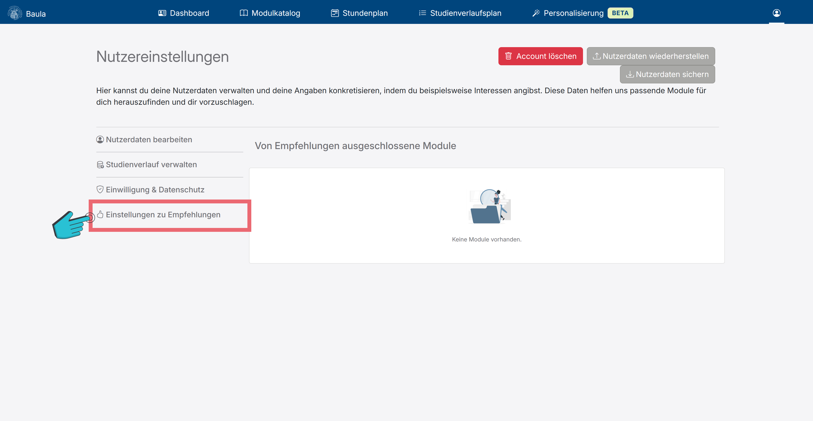

# Einstellungen

Um zu den Einstellungen zu gelangen, musst du oben rechts auf das :icon-person-fill:-Symbol klicken und anschließend auf :icon-gear: (vgl. Abbildung 1). 

Hier siehst du auf der linken Seite verschiedene Reiter mit verschiedenen Einstellungen. Durch ein klick auf einen Reiter siehst du die dazu gehörigen Einstellungen (vgl. Abbildung 2 A).

+++ Nutzerdaten bearbeiten

Oben rechts (vgl. Abbildung 4 A) kannst du:
-	Deinen Account löschen (inklusive aller dazugehörigen Daten).
-	Deine Nutzerdaten wiederherstellen.
-	Deine Nutzerdaten sichern (und sie z.B. zu einem späteren Zeitpunkt wiederherstellen).

In der Mitte (vgl. Abbildung 4 B) kannst du deinen Studiengang und dazugehörige Informationen anpassen.  

+++ Studienverlauf verwalten

Hier kannst du durch einen Klick auf „Studienverlauf löschen“ (vgl. Abbildung 5) deinen hinterlegten Studienverlauf löschen.

+++ Einwilligung & Datenschutz

Hier siehst du alle relevanten Datenschutzerklärungen, als auch deinen Zustimmungsstatus zu diesen. Durch einen Klick auf „Einwilligung widerrufen“ (vgl. Abbildung 6) kannst du deine, vorher erteilte, Zustimmung zu der entsprechenden Datenschutzerklärung zurücknehmen.

+++ Einstellungen zu Empfehlungen

Hier siehst du Module, bei welchen du angegeben hast, dass diese dir nicht mehr vorgeschlagen werden sollen.