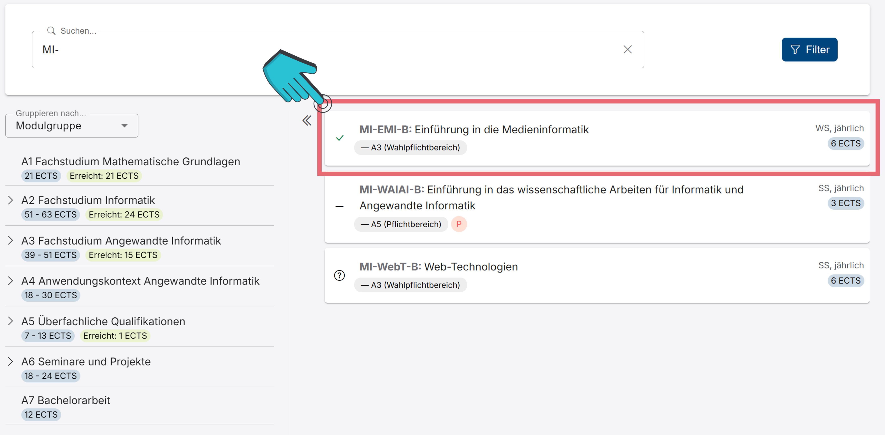
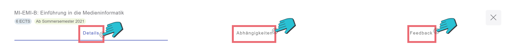
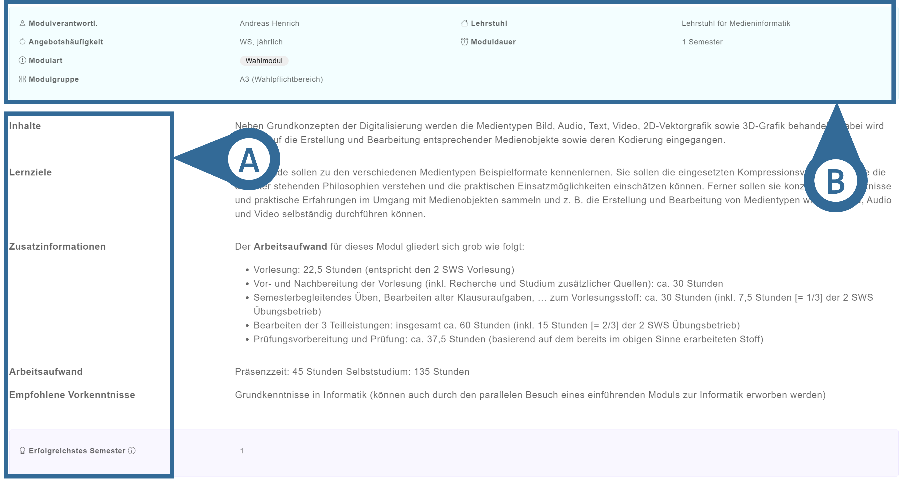
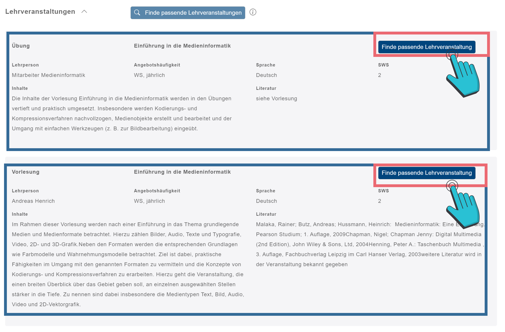
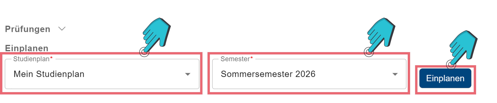
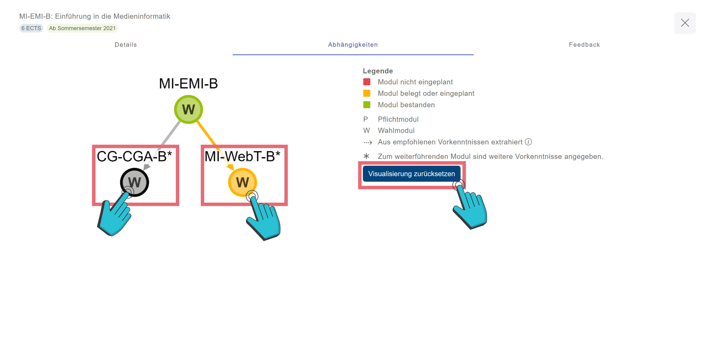
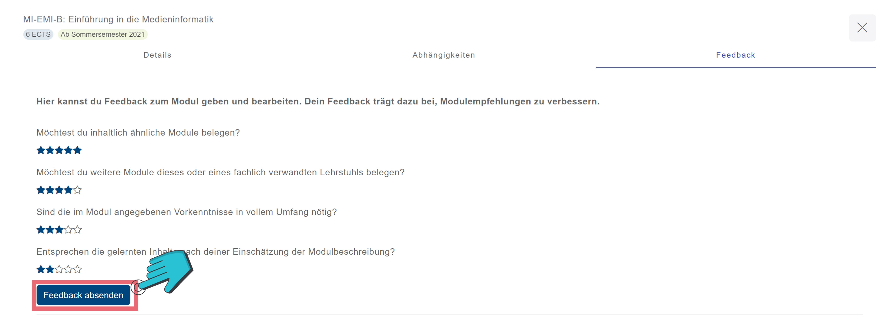

# Modul-Detailansicht
<!-- Modul Auswahl -->

Nachdem du ein interessantes Modul gefunden hast, kannst du diesen anklicken (vgl. Abbildung 1), um anschließend zusätzliche Informationen zu erhalten.

<!-- Modul-Reiter -->

Diese Informationen sind in drei Reiter aufgeteilt, welche du auch anklicken (vgl. Abbildung 2) kannst, um bestimmte Informationen zu sehen.

+++ Details
==- Modulinformationen
<!-- Modul-Informationen -->

Die Modulinformationen enthalten einen groben Überblick über das Modul (vgl. Abbildung 3 B), als auch verschiedene spezielle Informationen (vgl. Abbildung 3 A), welche dich möglichst gut über das Modul aufklären sollen. Diese sind im Folgenden kurz erklärt:
<!-- Stichworte erklärt -->
Stichwort                     | Erklärung    
---                           | ---
Inhalte                       | Hier wird dir darüber berichtet, worum es in dem Modul geht.
Lernziele                     | Hier werden die Lernziele, welche nach dem erfolgreichen Abschluss des Moduls erreicht werden sollten, beschrieben.
Zusatzinformationen           | Hier findest du zusätzliche Informationen zum Modul.
Arbeitsaufwand                | Hier wird eine grobe Abschätzung des Arbeitsaufwands für das Modul gegeben.
Empohlene Vorkenntnisse       | Hier werden Vorkenntnisse beschrieben, welche zwar nicht zwingend notwendig sind, aber den Einstieg in das Modul erleichtern können.
Erfolgreichstes Semester      | Dies gilt als ungefährer Richtwert, in welchem Semester das Modul am häufigsten erfolgreich abgeschlossen wird.

==- Lehrveranstaltungen

Module haben im Regelfall auch eine dazu gehörige Lehrveranstaltung. Hier kannst du die verschiedenen Lehrveranstaltungstypen (z.B. Vorlesung, oder Übung) sehen und durch einen Klick auf <button class="btn btn-primary my-1 py-3 px-4"> Finde passende Lehrveranstaltung </button> (vgl. Abbildung 4) wirst du auf die „Stundenplan“-Seite weitergeleitet, wo du anschließend die Veranstaltung zu deinem Stundenplan hinzufügen kannst.

[!ref](../Stundenplan/stundenplan.md)

==- Prüfungen

Im „Prüfungen“-Reiter kannst du die Form der Prüfung des Moduls ansehen. Hier wird die Art der Prüfung (vgl. Abbildung 5 A), eine Beschreibung (vgl. Abbildung 5 B), die Prüfungsdauer (vgl. Abbildung 5 C) und der Anteil an der Gesamtnote für das Modul (vgl. Abbildung 5 D) der jeweiligen Prüfung aufgelistet. 

==- Einplanen

Hier kannst du ein Modul direkt einplanen. Dafür musst du den Stundeplan, zu welchem du das Modul hinzufügen willst, und das Semester auswählen (vgl. Abbildung 6).
===
+++ Abhängigkeiten

Dieser Reiter gibt dir Informationen darüber, von welchem Modul das betrachtete Modul abhängt (z.B., wenn es empfohlen wird, vorher ein anderes Modul abzuschließen) und welche anderen Module von diesem Modul abhängen. Durch einen Klick auf die Module (vgl. Abbildung 7) öffnet sich die entsprechende Modul-Detailseite. 

+++ Feedback

Der „Feedback“-Reiter ermöglicht es dir, Feedback, in Form von 0-5 Sternen, abzugeben. Dadurch können wir bessere Modulempfehlungen für dich erstellen. Das Feedback kann durch einen Klick auf <button _ngcontent-ng-c2278834521="" id="timetable_add_button" apphovertracker="" aria-label="Lehrveranstaltungssuche öffnen" tabindex="0" class="btn btn-primary ms-2 d-none d-sm-inline plausible-event-name=Timetable-Add+Button">Feedback absenden</button> (vgl. Abbildung 8) gespeichert werden. 
