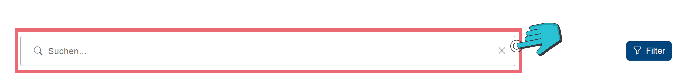
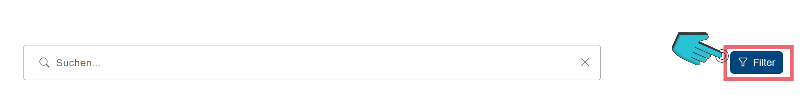
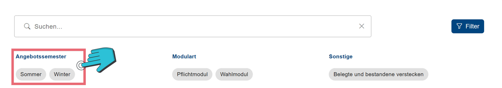
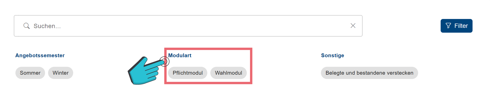

# Modul-Suchleiste
<!-- Suchleiste -->

In der Modul-Suche kannst du nach bestimmten Modulen suchen.
Durch einen Klick auf das „Suchen“-Feld (vgl. Abbildung 1) kannst du den Modulname, oder einen Teil davon, eingeben. Dir werden anschließend automatisch passende Module angezeigt. 

<!-- Filter -->

Es können auch zusätzliche Filter in der Suche angewandt werden. Diese siehst du, indem du auf <button _ngcontent-ng-c1874965177="" class="btn btn-primary my-1 py-3 px-4"><i class="filter-icon bi bi-funnel"></i> Filter </button> (vgl. Abbildung 2) drückst und können durch einen Klick auf das jeweilige Filter-Feld angewandt werden.

<!-- Angebotssemester -->

Das „Angebotssemester“ (vgl. Abbildung 3) filtert Module nach dem Semester, in welchem sie angeboten werden.

<!-- Modulart -->

Die „Modulart“ (vgl. Abbildung 4) filtert die Module nach Pflichtmodul (Module, welche in deinem angegebenen Studiengang belegt werden müssen) und Wahlmodule (Module, welche du einbringen kannst, aber keine Pflicht sind).

<!-- Sonstige -->

Unter „Sonstige“ (vgl. Abbildung 5) kannst du einstellen, dass belegte und bestandene Module, wie es in deinem Account hinterlegt ist, versteckt werden.
