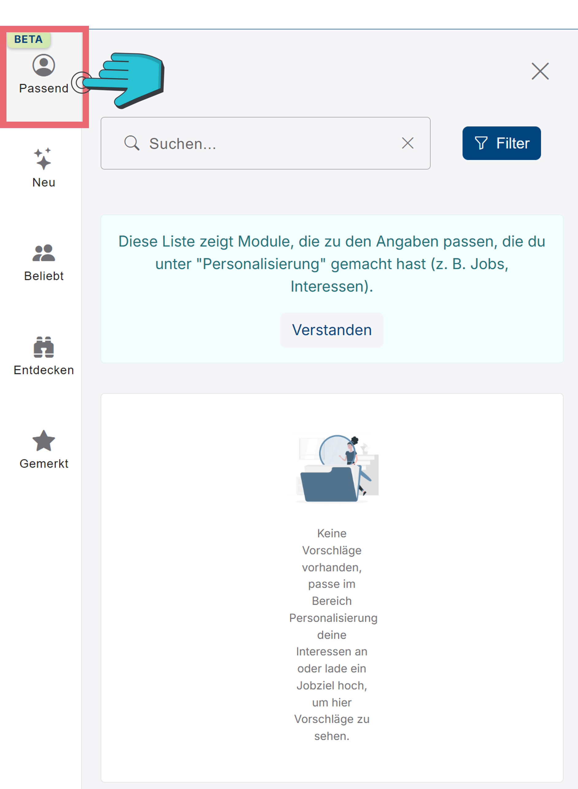
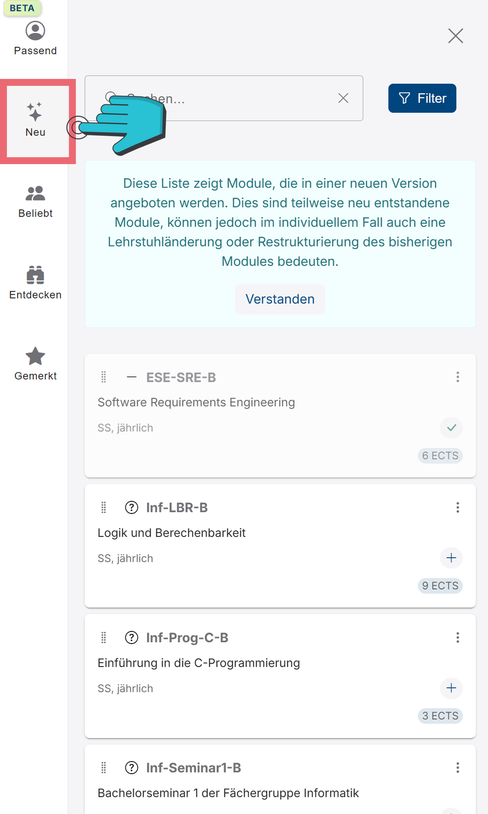
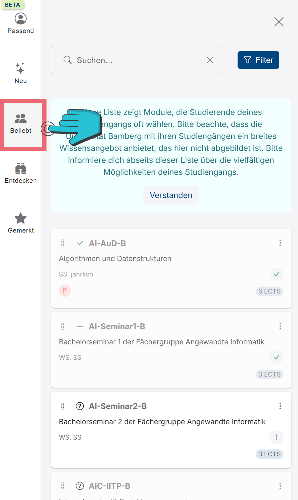
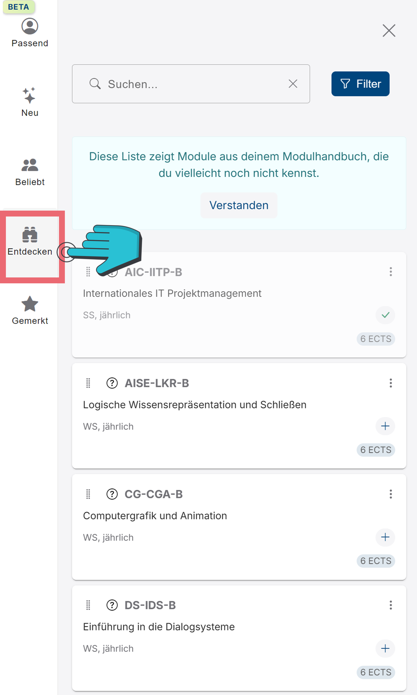
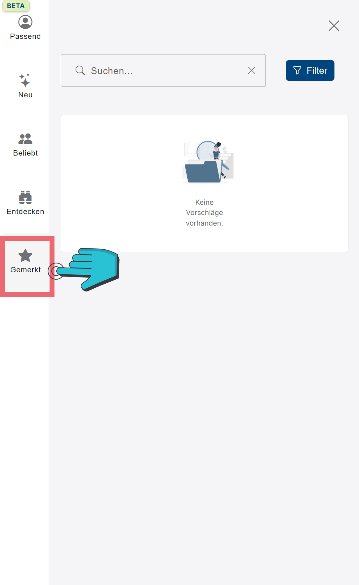

# Modulempfehlungen für den Studienverlaufsplan
Die Modulempfehlungsleiste befindet sich am linken Rank der Website und kann mithilfe der blau hinterlegten Pfeile ein-, bzw. ausgeklappt werden. Unter jedem Reiter der Leiste ist es dir möglich, nach bestimmten Modulnamen zu suchen, als auch die angezeigten Module nach bestimmten Kriterien zu filtern. Mehr zu den Filteroptionen findest du hier:
[!ref](../Modulkatalog/suchleiste.md)

+++ Passend
||| Screenshot

||| Erklärung
Dies sind Modulempfehlungen, welche speziell auf deine Vorlieben angepasst wurden, wie du sie z.B. unter „Personalisierung“ angegeben hast.
|||

+++ Neu
||| Screenshot

||| Erklärung
Hier befinden sich neue und aufregende Module im Angebot deines Studiengangs.
|||

+++ Beliebt
||| Screenshot

||| Erklärung
Dies sind Module, welche bei deinen Mitstudierenden gut ankommen.
|||

+++ Entdecken
||| Screenshot

||| Erklärung
Hier sind Module enthalten, welche du vielleicht beim Durchstöbern des Modulhandbuchs übersehen hast.
|||

+++ Gemerkt
||| Screenshot

||| Erklärung
Dies sind die Module, welche du als „gemerkt“ markiert hast.
|||