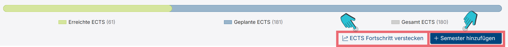
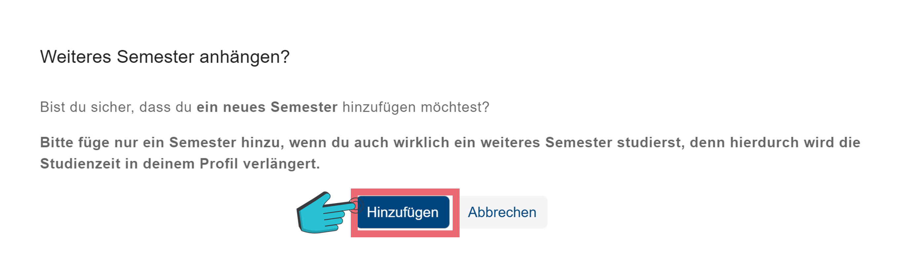

# Semesterübersicht im Studienverlaufsplan

<!-- Allgemeine Übersicht -->

Die Semesterübersicht enthält detaillierte Informationen über deinen Studienverlauf. 
In der Kopfzeile (vgl. Abbildung 1 A) kannst du:
- Den Stand des jeweiligen Semesters (Abgeschlossen, Laufen) sehen
- Dein wievieltes Semester es ist sehen
- Wann das Semester ist (Wintersemester/ Sommersemester und Jahr) sehen
- Das Semester einklappen
- Eine Leistung mithilfe des <button class="mat-mdc-menu-trigger btn btn-outline bg-white"><i class="mat-mdc-tooltip-trigger btn-icon plus-icon bi bi-plus-lg"></i></button>-Knopfs hinzufügen
- Die erreichten ECTS/ die eingeplanten ECTS

Unterhalb der Kopfzeile (vgl. Abbildung 1 B) sind die Module des jeweiligen Semesters zu sehen. Die Module enthalten jeweils folgende Informationen:
- Den Namen 
- Ob es bestanden (<button class="btn-icon ng-star-inserted"><i class="bi bi-check-lg text-success"></i></button>), nicht bestanden (<button class="btn-icon ng-star-inserted"><i class="bi bi-x-lg text-danger"></i></button>), oder ob es in der Zukunft eingeplant (<button class="btn-icon ng-star-inserted"><i class="bi bi-dash-lg"></i></button>) ist
- Wie viele ECTS es für das Modul gibt
- Den Bereich
- Ob es ein Pflicht Modul ist (<i>P</i>)
- Wenn du das Modul bereits bestanden hast: die Note
- Auch kannst du mithilfe des <i class="icon bi bi-three-dots-vertical text-gray"></i>-Knopfs am Rand oben rechts ein Modul anpassen und mithilfe des <i class="icon bi bi-grip-vertical text-gray"></i>-Knopfs oben links den Platz des Moduls in diesem Semester verschieben

<!-- ECTS Fortschritt -->

Der <button class="mat-mdc-tooltip-trigger study-progress btn btn-outline btn-sm ng-star-inserted"><i class="bi bi-graph-up-arrow"></i> ECTS Fortschritt anzeigen </button>-Knopf (vgl. Abbildung 1) zeigt dir eine Grafik über deine erreichten und geplanten ECTS (vgl. Abbildung 2) an.

<!-- Semester anhängen -->

Der <button _ngcontent-ng-c2278834521="" id="timetable_add_button" apphovertracker="" aria-label="Lehrveranstaltungssuche öffnen" tabindex="0" class="btn btn-primary ms-2 d-none d-sm-inline plausible-event-name=Timetable-Add+Button"><i _ngcontent-ng-c2278834521="" class="bi bi-plus-lg"></i>Semester hinzufügen</button>-Knopf (vgl. Abbildung 2) ermöglicht es dir, ein Semester über deiner Regelstudienzeit hinzuzufügen (vgl. Abbildung 3).
