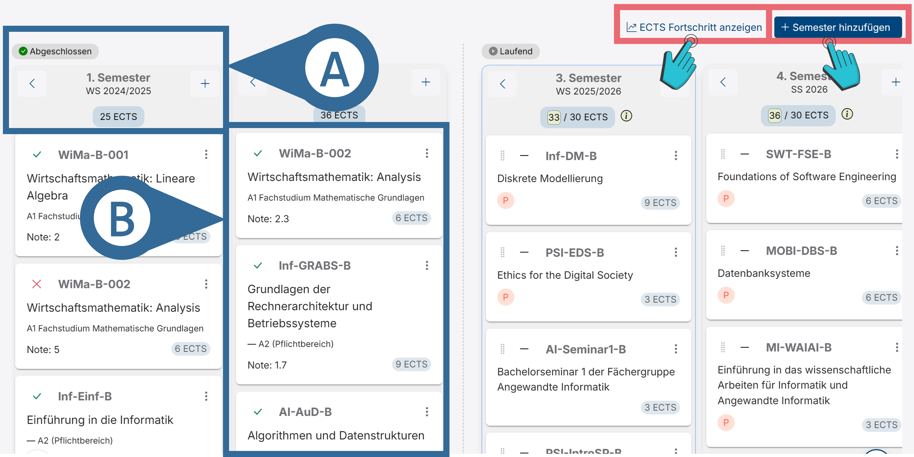
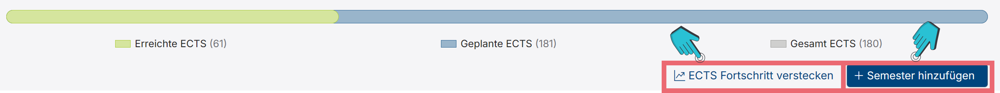
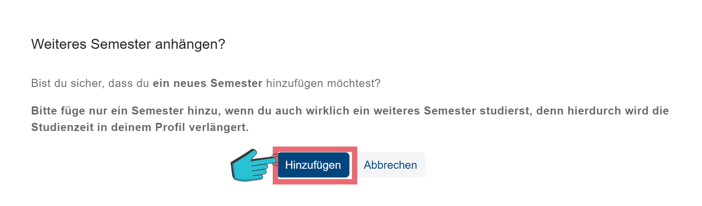

# Semesterübersicht im Studienverlaufsplan

<!-- Allgemeine Übersicht -->

Die Semesterübersicht enthält detaillierte Informationen über deinen Studienverlauf. 
In der Kopfzeile (vgl. Abbildung 1 A) kannst du:
- Den Stand des jeweiligen Semesters (Abgeschlossen, Laufen) sehen
- Dein wievieltes Semester es ist sehen
- Wann das Semester ist (Wintersemester/ Sommersemester und Jahr) sehen
- Das Semester einklappen
- Eine Leistung mithilfe des „:icon-plus:“-Knopfs hinzufügen
- Die erreichten ECTS/ die eingeplanten ECTS

Unterhalb der Kopfzeile (vgl. Abbildung 1 B) sind die Module des jeweiligen Semesters zu sehen. Die Module enthalten jeweils folgende Informationen:
- Den Namen 
- Ob es bestanden (grünes :icon-check:), nicht bestanden (rotes :icon-x:), oder ob es in der Zukunft eingeplant (graues :icon-dash:) ist
- Wie viele ECTS es für das Modul gibt
- Den Bereich
- Ob es ein Pflicht Modul ist (rötlich hinterlegtes P)
- Wenn du das Modul bereits bestanden hast: die Note
- Auch kannst du mithilfe der drei Punkte am Rand oben rechts ein Modul anpassen und mithilfe der 10 Punkte oben links den Platz des Moduls in diesem Semester verschieben

<!-- ECTS Fortschritt -->

Der „:icon-graph: ECTS Fortschritt anzeigen“-Knopf (vgl. Abbildung 1) zeigt dir eine Grafik über deine erreichten und geplanten ECTS (vgl. Abbildung 2) an.

<!-- Semester anhängen -->

Der „:icon-plus: Semester hinzufügen“-Knopf (vgl. Abbildung 2) ermöglicht es dir, ein Semester über deiner Regelstudienzeit hinzuzufügen (vgl. Abbildung 3).
