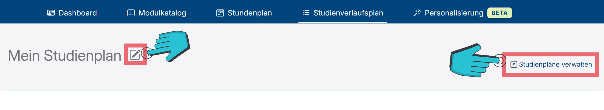
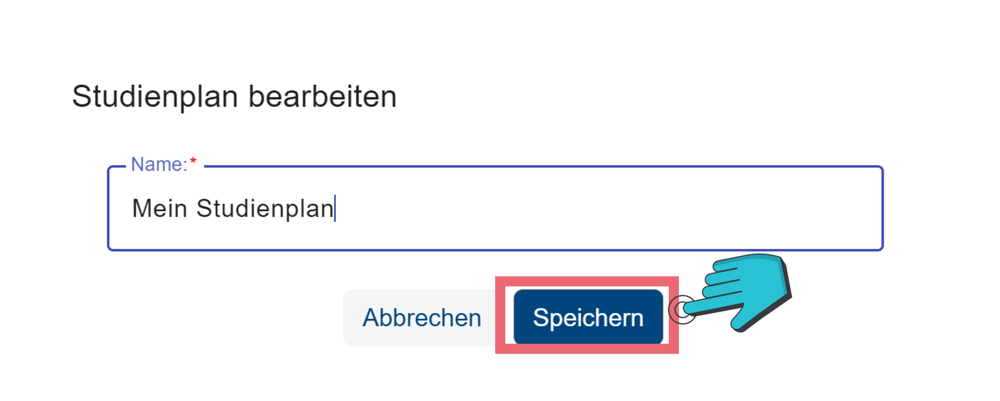
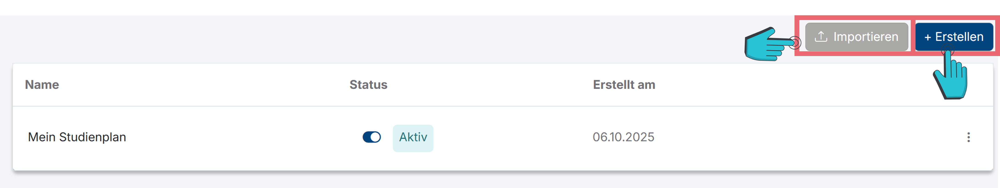
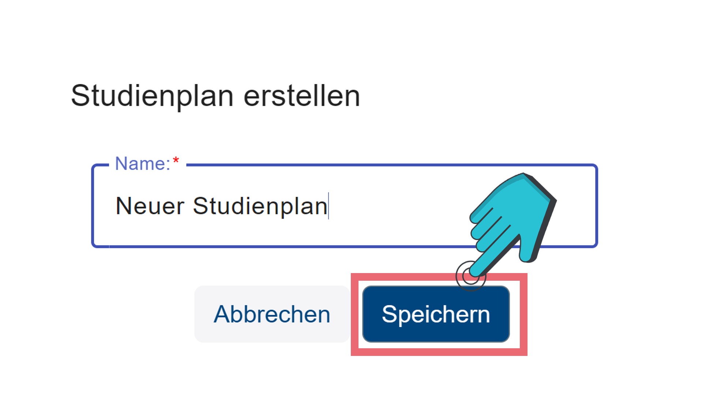
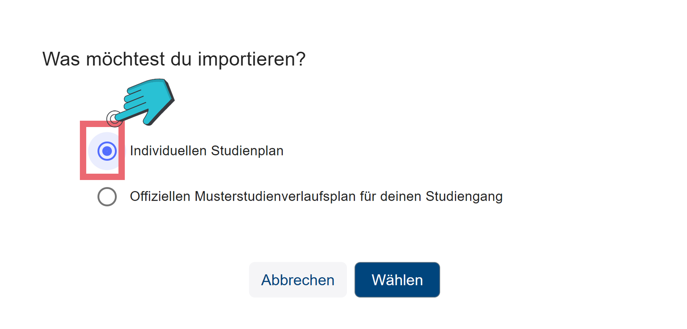
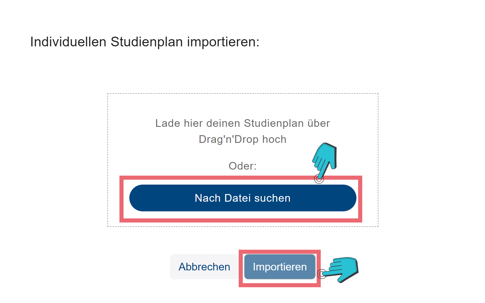
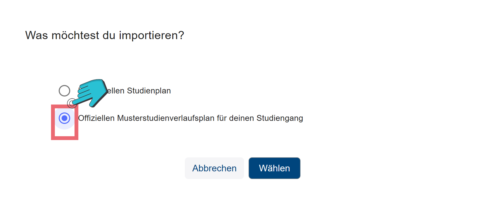
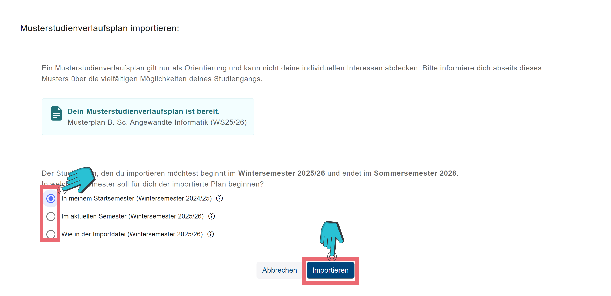

# Studienplan

## Übersicht

Dein Studienplan enthält deine Semester und die Module, welche jeweils eingeplant sind. 
Wenn du auf das <i class="edit-pencil icon bi bi-pencil-square d-inline text-gray"></i>-Icon neben den Studienplannamen (vgl. Abbildung 1) drückst, öffnet sich ein neues Fenster, in welchem du den Namen des Studienplans anpassen kannst. Um den neuen Namen zu speichern, musst du anschließend auf den <button class="btn btn-primary ms-2 d-sm-inline">Speichern</button>-Knopf (vgl. Abbildung 2) drücken.

Rechts findest du den <button class="btn btn-blue-outline manage-study-plans"><i class="bi bi-arrow-up-right-square"></i> Studienpläne verwalten </button>-Knopf (vgl. Abbildung 1), welcher dich auf die Übersichtsseite für deine Studienpläne bringt.

## Studienplan erstellen

Hier kannst du neue Studienpläne erstellen, indem du auf den <button class="btn btn-primary ms-2 d-sm-inline"><i class="bi bi-plus-lg"></i>Erstellen</button>-Knopf (vgl. Abbildung 3) drückst, einen Namen eingibst und anschließend auf <button class="btn btn-primary ms-2 d-sm-inline">Speichern</button> (vgl. Abbildung 4) drückst.

## Individuellen Studienplan importieren

Auch kannst du hier Studienpläne mithilfe des <button class="mat-mdc-menu-trigger btn btn-secondary me-2 mb-2 mb-lg-0"><i class="bi bi-upload me-1"></i>Importieren</button>-Knopfs (vgl. Abbildung 3) laden.
Du hast hier die Möglichkeit einen Individuellen Studienplan (vgl. Abbildung 5) zu importieren. Dafür öffnet sich ein neues Fenster, in welchen du entweder den Individuellen Studienplan (dies ist ein Studienplan, welcher vorher eigens erstellt wurde) per Drag’n’Drop, oder indem du auf <button class="btn btn-primary ms-2 d-sm-inline">Nach Datei suchen</button> (vgl. Abbildung 6) drückst, hochladen und anschließend mit dem <button class="btn btn-primary ms-2 d-sm-inline">Importieren</button>-Knopf (vgl. Abbildung 6) importieren.

## Offiziellen Musterstudienplan importieren

Auch kannst du einen offiziellen Musterstudienverlaufsplan (ein Plan, welcher typische Module in den typischen Semestern enthält) importieren, indem du zuerst auf „Offiziellen Musterstudienverlaufsplan für deinen Studiengang“ (vgl. Abbildung 7) drückst. Anschließend öffnet sich ein neues Fenster, in dem du sehen kannst, ob für deinen Studiengang ein Musterstudienverlaufsplan existiert und dann das Startsemester auswählen kannst. Zum Schluss musst du dann auf <button class="btn btn-primary ms-2 d-sm-inline">Importieren</button> (vgl. 8) drücken.
