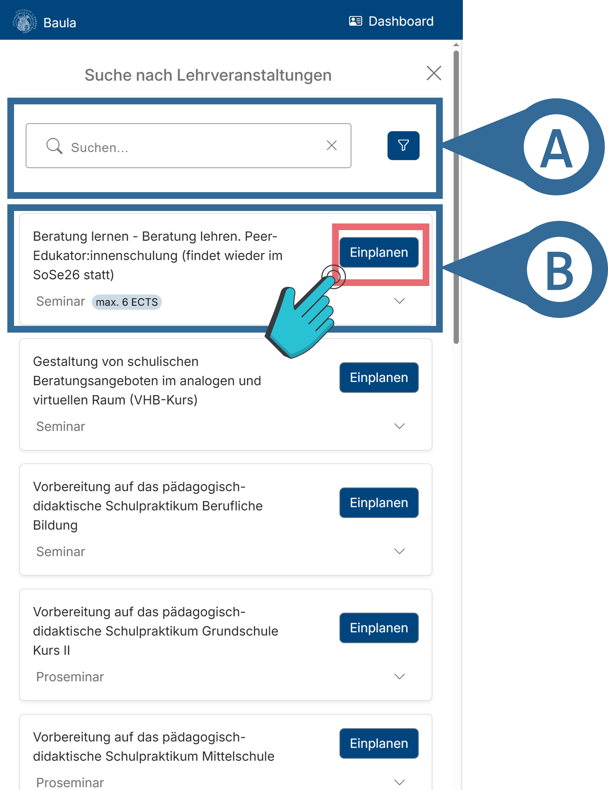
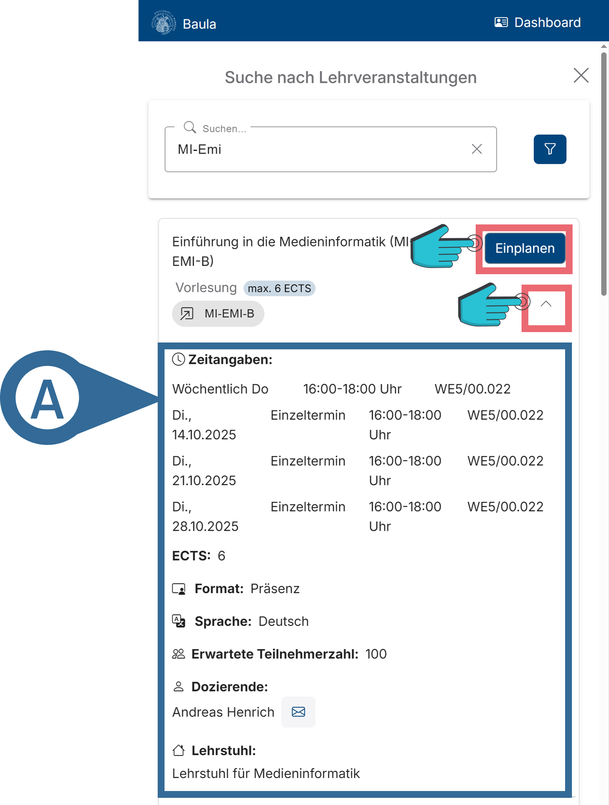
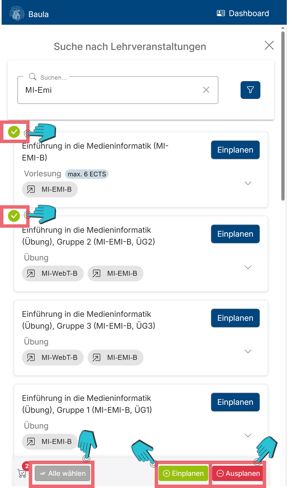
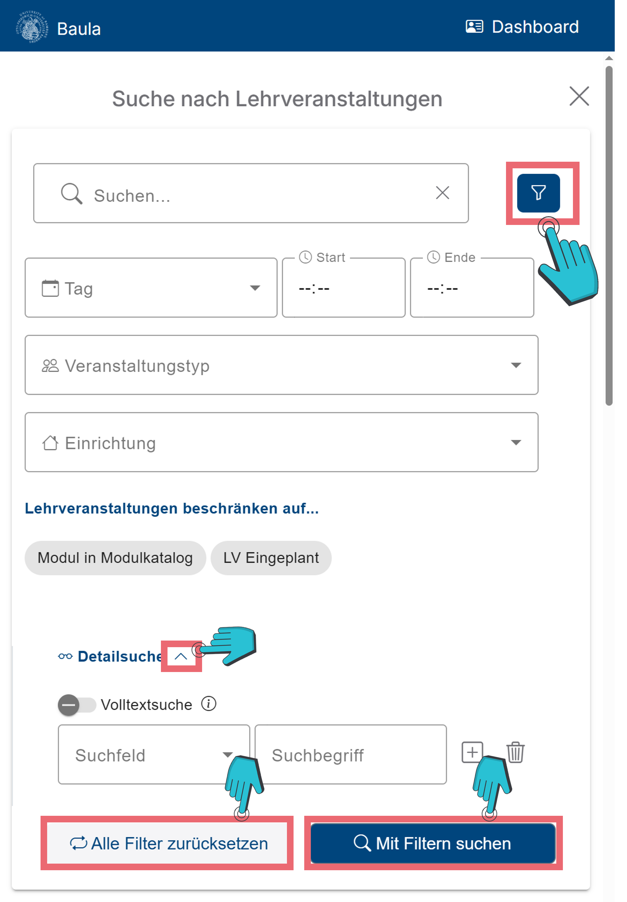

# Eine Lehrveranstaltung zum Studenplan hinzufügen
Hier hast du die Möglichkeit Lehrveranstaltungen zu suchen und zu deinem Stundenplan hinzuzufügen.

## Übersicht
||| Bild

||| Erklärung
Mithilfe der Suchleiste (vgl. Abbildung 1 A) kannst du nach bestimmten Kursen suchen. Dazu gib einfach den Namen, oder ein Teil des Namens, in die Suchleiste ein.
|||

## Zusätzliche Informationen zu einer Lehrveranstaltung
||| Erklärung
Anschließend kannst du zusätzliche Informationen zu einer Lehrveranstaltung durch einen Klick auf diese erhalten (vgl. Abbildung 2 A), oder durch einen Klick auf <button class="mat-mdc-tooltip-trigger btn btn-success me-2 btn-sm expand-on-click"><i class="bi bi-plus-circle"></i>  Einplanen</button> in deinen Stundenplan aufnehmen (vgl. Abbildung 1).
||| Bild

|||

## Mehrere Lehrveranstaltungen gleichzeitig hinzufügen
||| Bild

||| Erklärung
Alternativ kannst du auch mehrere Lehrveranstaltungen gleichzeitig hinzufügen. Dies geht, indem du über die jeweiligen Lehrveranstaltungen hoverst, oben links ein Häkchen setzt, um diese zu markieren und anschließend auf <button class="mat-mdc-tooltip-trigger btn btn-success me-2 btn-sm expand-on-click"><i class="bi bi-plus-circle"></i>  Einplanen<!----></button> klickst (vgl. Abbildung 3).

Hier kannst du auch <button  class="mat-mdc-tooltip-trigger btn btn-secondary me-2 btn-sm expand-on-click" ><i  class="bi bi-check-all"></i> Alle wählen <!----></button>, so dass automatisch alle Lehrveranstaltungen, passend zu deiner Suche, markiert werden. 

Durch <button  mattooltip="Aus dem Stundenplan entfernen" class="mat-mdc-tooltip-trigger btn btn-danger btn-sm expand-on-click" ><i class="bi bi-dash-circle"></i> Ausplanen<!----></button> werden markierte Lehrveranstaltungen aus deinem Stundenplan entfernt.
|||

## Filterfunktion der Suchleiste
||| Erklärung
Die erweiterte Suchleiste kann durch einen Klick auf das „Filter“-Symbol aufgerufen werden (vgl. Abbildung 4). Hier stehen dir verschiedene Filterfunktionen zur Verfügung, welche im Folgenden kurz erklärt werden:

- <i class="bi bi-calendar-event"></i> Tag: Der Wochentag, an dem die Lehrveranstaltung stattfinden soll.
- <i class="bi bi-clock"></i> Start/ <i class="bi bi-clock"></i> Ende: Die Uhrzeit, zu welcher die Lehrveranstaltung anfangen/ enden soll, im Format HH:MM (H = Stunde, M = Minute).
- <i class="bi bi-people"></i> Veranstaltungstyp: Welcher Art die Lehrveranstaltung sein soll (z.B. ein Seminar, oder eine Übung).
- <i class="bi bi-house"></i> Einrichtung: Welcher Einrichtung, oder Fakultät, die Lehrveranstaltung angehören soll.
-	Lehrveranstaltungen beschränken auf…: Hier kann die Suche so angepasst werden, dass nur Module angezeigt werden, welche auch in deinem Modulhandbuch sind, und das nur bereits eingeplante Lehrveranstaltungen angezeigt werden sollen.
-	Die Detailsuche kann durch einen Klick auf das <i class="bi bi-chevron-up"></i>/<i class="bi bi-chevron-down show-more-icon"></i>-Symbol ein- bzw. ausgeklappt werden. 
Durch das Klicken auf das Volltextsuche-Symbol kannst du die Volltextsuche entweder an- oder ausschalten (vgl. Abbildung 4). Mithilfe der Volltextsuche kannst du alle Informationen und Daten der Lehrveranstaltungen durchsuchen. Auch kannst du hier spezielle Felder (z.B. den Titel, oder die Beschreibung) nach bestimmten Inhalten untersuchen.

Durch einen Klick auf <button class="btn btn-primary ms-2 d-sm-inline"><i class="bi bi-search"></i> Mit Filtern suchen</button> werden dir Lehrveranstaltungen angezeigt, welche zu deinen Sucheinstellungen passen.
Indem du auf „<i class="bi bi-repeat"></i> Alle Filter zurücksetzen“ klickst, entfernst du alle von dir hinzugefügten Filter.

Du kannst nach belieben keine, eine, oder mehrere Suchfilter gleichzeitig aktiv haben. 
||| Bild

|||

