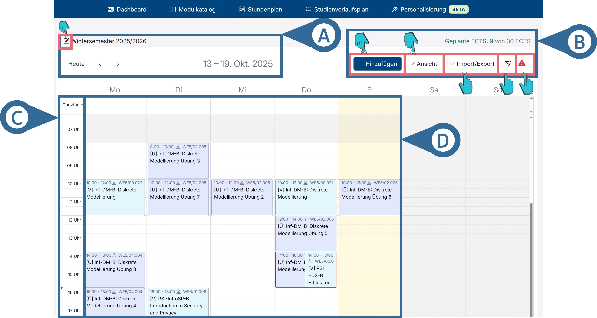

# Stundenplan

Mit dem Stundenplan hast du eine nützliche Übersicht deiner, in dem jeweiligen Semester, eingeplanten Lehrveranstaltungen.

+++ Kopfzeile (vgl. Abbildung 1 A)

Hier kannst du, durch einen Klick auf das <i class="bi bi-pencil-square mb-1"></i>, das Semester auswählen, für welches der Stundenplan angezeigt werden soll.

Außerdem siehst du den derzeitig dargestellten Zeitraum und kannst durch einen Klick auf „Heute“ zu dem aktuellen Zeitraum wechseln.

Durch das <i class="bi bi-chevron-left"></i> und <i class="bi bi-chevron-right"></i>-Symbol kannst du im Stundenplan nach hinten und vorne wechseln.

+++ Anpassungs-Schaltfläche (vgl. Abbildung 1 B)
Hier kannst du auf verschiedene Weisen mit dem Stundenplan interagieren. 

==- Hinzufügen
Mehr über das Hinzufügen von Lehrveranstaltungen findest du hier: 
[!ref](./kursEinplanen.md)

==- Ansicht
Die Ansichtseinstellungen sind hier näher erklärt: [!ref](../Dashboard/terminkalender.md)

==- Import/ Export
Diese Option ermöglicht es dir, deinen erstellten Stundenplan zu importieren und exportieren.

- Plan importieren (JSON): Hier kannst du einen vorher exportierten Stundenplan erneut laden.
- Plan exportieren (JSON): Hier kannst du einen vorher erstellten Stundenplan exportieren.
- Plan als PDF anzeigen: Dies zeigt dir eine PDF-Version deines Stundenplans in einem neuen Tab an, welche du anschließen herunterladen kannst.
- Plan in UnivIS anzeigen: Hier öffnet sich ein neuer Tab der UnivIS-Website, welche alle deine gespeicherten Lehrveranstaltungeenthält.

==- Konfiguration
Hier kannst du einstellen, ob auch die Wochenenden im Stundenplan angezeigt werden sollen.

==- Fehlermeldungen
Eine Erklärung zu den verschiedenen Fehlermeldungen findest du hier: 
[!ref](./stundenplanfehlermeldungen.md)

===

+++ Veranstaltungsübersicht (vgl. Abbildung 1 C, D)
Hier siehst du alle von dir eingeplanten Lehrveranstaltungen (vgl. Abbildung 1 D) inklusive wann diese stattfinden (vgl. Abbildung 1 C). 

Durch einen Klick auf eine Lehrveranstaltung kriegst du zusätzliche Informationen zu dieser und kannst sie durch einen Klick auf <button class="btn btn-danger me-2 mb-2 mb-lg-0">Lehrveranstaltung abwählen</button> abwählen.
